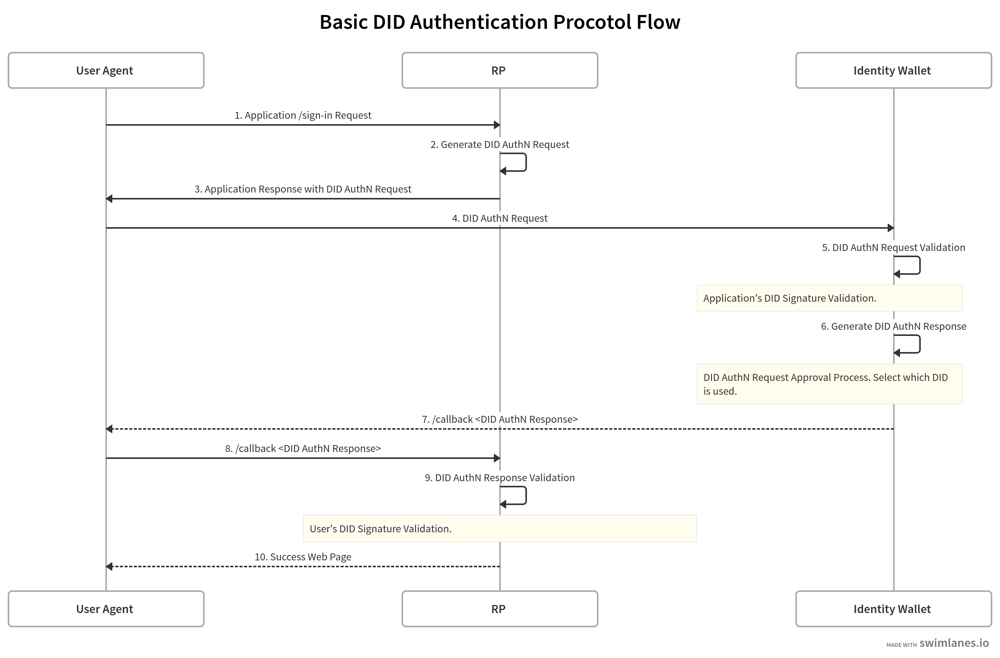

# did-auth

## DID AuthN

For the wallet to communicate with relying parties \(RP\) on secure authenticated channel, UNiD wallet SDKs provide methods of:

* validating DID AuthN request from a RP
* generating DID AuthN response to a RP

The below diagram illustrate the sign-in flow and steps taken to verify a user through their user agent from the wallet side of the webpage to the server side of a RP. If you want to see more details of DID AuthN, please head over [here](https://github.com/getunid/unid-docs/tree/8515a1dcda076b9bea8d6e6e6b7eed90e22ae0d3/unid/3-extensions/README.md).



## Validate AuthN Request

In step 5 of the diagram, the wallet receives an authN request from the RP. The wallet queries for the RP's DID document using a Universal Resolver and verifies the signature with the RP's public key.

**UNiD.validateAuthenticationRequest\(\)**

```javascript
import { UNiD } from "@unid/react-native-sdk";

(async () => {
    try {
        // DID AuthN Request with applicationDid
        const result = await UNiD.validateAuthenticationRequest(applicationDid);
        console.log("Complete validating DID AuthN Request", result);
    } catch err(err){
        console.err(err);
    };
})()
```

## Generate DID AuthN Response

In step 6 of the diagram, the wallet creates a DID AuthN response signed by the selected DID. The response object can envelop a verifiable presentation and will be put into a JWS signed by the DID.

**DID.generateAuthenticationResponse\(\)**

```javascript
import { UNiD } from "@unid/react-native-sdk";

(async () => {
    try {
        const DID = await UNiD.loadDid({
            did: "did:unid:test:EiCsnBO7XrB9hL96xvQ2R846j_Ebuyg3HO5o4BOSoU7ffg"
        });
        const result = await DID.generateAuthenticationResponse({
            requestedPresentation: presentation
        });
        console.log("Complete generating DID AuthN Response", result);
    } catch err(err){
        console.err(err);
    };
})()
```

