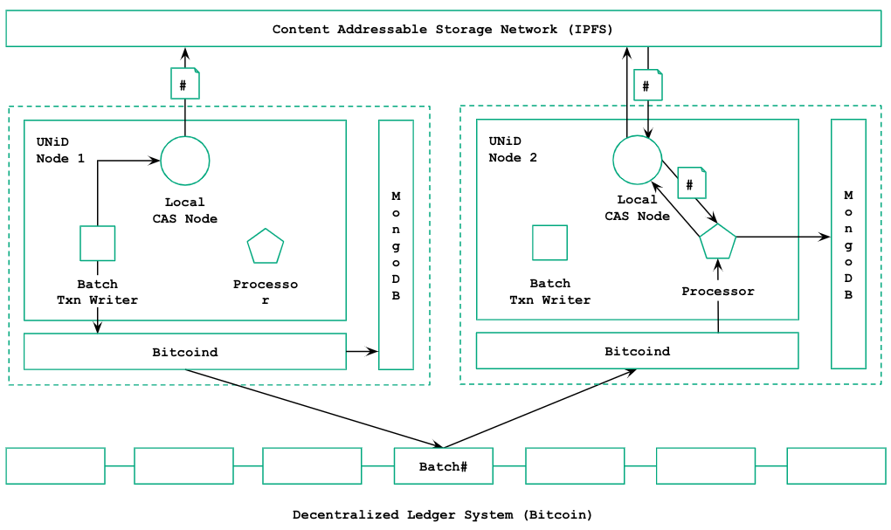

# UNiD Network

## DPKI

UNiD Network is built on the top of Sidetree that is a 2nd layer blockchain-agnostic protocol and has multiple reference implementations for various decentralized ledger systems, such as Bitcoin, Ethereum, etc.

UNiD network consists of primary components of a DID overlay network:

1. The underlying ledger system that serves as the global anchoring and linear sequencing system for DID operations.
2. The nodes in below figure, which interact with the ledger system to anchor operations, fetch and replicate data from the CAS network, and process operations in accordance with the protocol deterministic rule set.
3. An integrated CAS network layer the nodes use to distribute and replicate DID operation files.

If you want to see how to operate and resolve DIDs on UNiD network, please [click here for more info](https://www.notion.so/collabogate/UNiD-Network-1113de045f2547bfb134757ce505361c).

UNiD network also serves a SDS \(Secure Data Storage\) storing encrypted verifiable credentials and presentations in a secure and privacy-preserving manner. UNiD SDS has authentication mechanisms to verify all requests with DID signature and pre-configured tenant token and authorization mechanisms to grant access to third parties.

## Secure Data Storage

